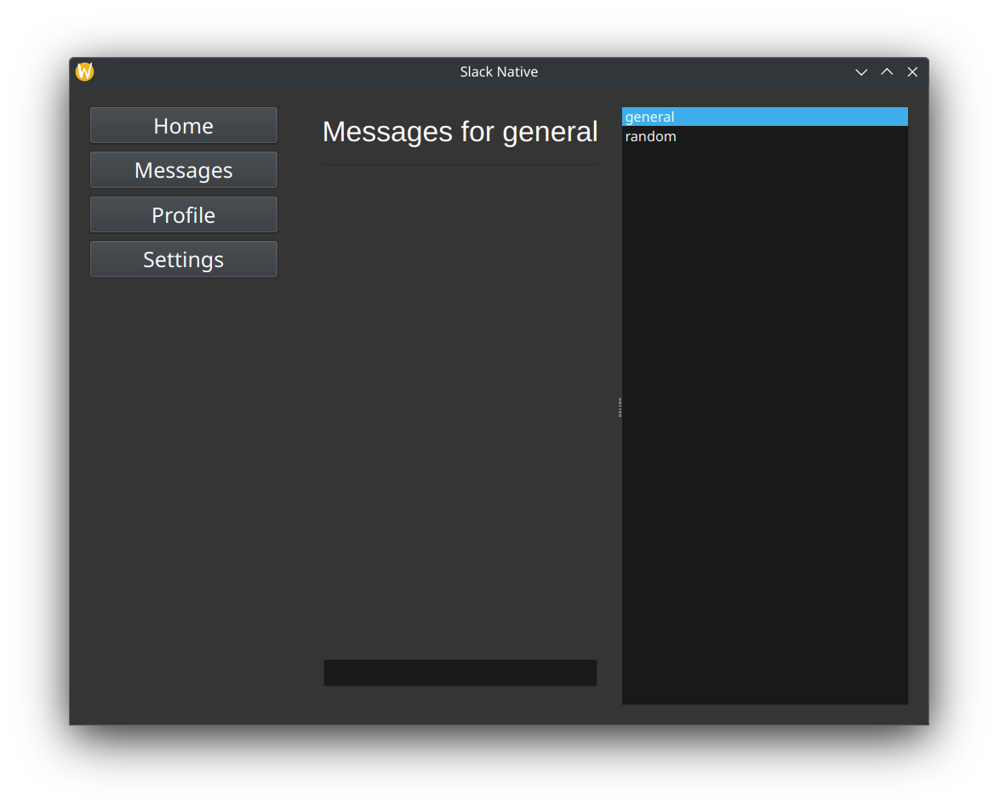

# slack-native
A native Slack app. Designed with Python and PySide6 (Qt bindings) for a simple, speedy application.


# Usage
To use the program, simply run the compiled executable.

**PS:** the program is not pre-compiled; you'll have to follow the instructions below for compilation.

# Compiling
To compile, you can use `pyinstaller`.
For example:
```sh
pyinstaller --onefile src/slack-native/main.py -o slack-native
```

It is advised to use a virtual environment for installation of Python modules.

You can use anything, i.e: `poetry`, `rye`, `pyenv`.

Just make sure that you configure the commands accordingly.